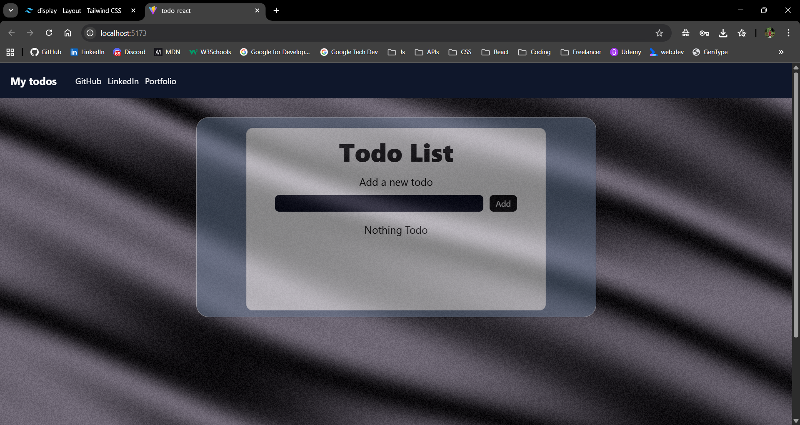
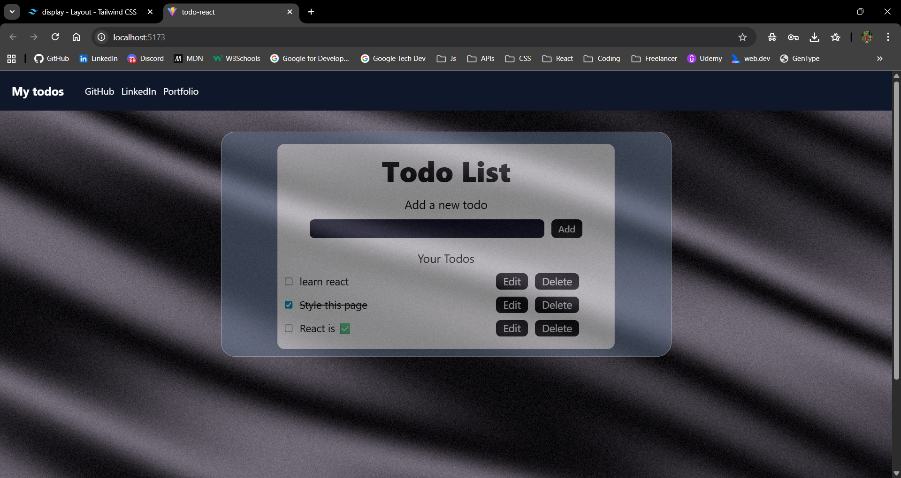

# ✨ Todo React - Premium Task Management

A sophisticated, high-performance Todo application built with **React 19**, **Vite**, and **Tailwind CSS 4**. Featuring a stunning 3D background powered by **Three.js** and smooth interactive experiences with **GSAP**.

[](https://react.dev/)
[](https://vitejs.dev/)
[](https://tailwindcss.com/)
[](https://threejs.org/)

---

## 📸 Screenshots


_Home View - 3D Background & Interaction_


_Task Management - CRUD in Action_

---

## 🌟 Key Features

- 🚀 **Lightning Fast** - Built on Vite 7 for near-instant HMR and production builds.
- 🎨 **Premium Aesthetics** - Modern UI design using Tailwind CSS 4 with a focus on typography and spacing.
- 🧊 **3D Visuals** - Immersive 3D silk animation background using `@react-three/fiber` and `Three.js`.
- 🔄 **State Management** - Robust todo handling with CRUD operations (Create, Read, Update, Delete).
- 💾 **Persistent Storage** - Seamless local storage integration ensures your tasks are saved between sessions.
- 📱 **Fully Responsive** - Optimized for mobile, tablet, and desktop viewing experiences.
- ✨ **Interactive Feedback** - Smooth animations and transitions using GSAP.

## 🛠️ Tech Stack

- **Core**: React 19 (Latest stable)
- **Build System**: Vite 7
- **Styling**: Tailwind CSS 4
- **3D Engine**: Three.js & React Three Fiber
- **Animations**: GSAP (GreenSock Animation Platform)
- **Utilities**: UUID for unique task identification
- **Linting**: ESLint 9 (Flat Config)

## 📂 Project Structure

```bash
src/
├── components/          # Reusable UI components
│   ├── Navbar.jsx       # Navigation header
│   ├── Footer.jsx       # App footer
│   └── Silk.jsx         # 3D Background logic
├── App.jsx              # Main application logic & State
├── App.css              # App-specific overrides
├── index.css            # Tailwind directives
└── main.jsx             # Application entry point
```

## 🚀 Getting Started

### Prerequisites

- **Node.js**: v18.0.0 or higher
- **npm** or **yarn**

### Installation

1. **Clone the repository**:

   ```bash
   git clone https://github.com/yourusername/todo-react.git
   cd todo-react
   ```

2. **Install dependencies**:

   ```bash
   npm install
   ```

3. **Start the development server**:

   ```bash
   npm run dev
   ```

4. **Build for production**:

   ```bash
   npm run build
   ```

## 💡 Usage

- **Add Task**: Type in the input field and click "Add" or press Enter.
- **Edit Task**: Click the "Edit" button to bring the task back to the input for modification.
- **Complete Task**: Click the checkbox to toggle completion status.
- **Delete Task**: Click the "Delete" button to permanently remove a task.
- **Auto-Save**: No need to manually save; everything is stored in your browser's local storage.

## 🎭 Visual Experience

The application features a "Silk" component which renders a dynamic, noise-driven 3D mesh. This provides a premium, "Apple-like" aesthetic that sets it apart from standard todo applications.

---

**Made with ❤️ by [Aryan](https://github.com/aryan-anand-sde)**
